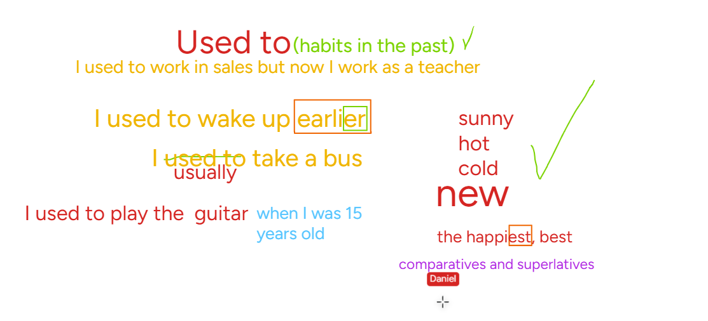

# 📝 Clase 01 — Past Simple

**Fecha:** 2026-01-29
**Tema:** Past Simple
**Nivel:** B2
**Recurso:** [Genially - Word of the year B2](https://view.genially.com/697bd71f8d455e0efd548df2)

---

## 🎯 ¿Para qué se usa? (Function)

El **Past Simple** se usa para:
- Acciones que **empezaron y terminaron** en el pasado
- Un **momento específico** en el pasado

> *I visited Rome last year.*
> *She called me yesterday.*

---

## 🏗️ Estructura

### ✅ Positivo

| Sujeto | Verbo (pasado) | Resto |
|--------|---------------|-------|
| I / You / He / She / We / They | worked / went / ate | ... |

> *He **worked** late last night.*
> *They **went** to the park.*

---

### ❌ Negativo

| Sujeto | Auxiliar | Verbo (base) | Resto |
|--------|----------|-------------|-------|
| I / You / He / She / We / They | **did not** (didn't) | work / go / eat | ... |

> *She **didn't call** me.*
> *We **didn't go** to the party.*

---

### ❓ Pregunta

| Auxiliar | Sujeto | Verbo (base) | Resto |
|----------|--------|-------------|-------|
| **Did** | I / you / he / she / we / they | work / go / eat | ...? |

> ***Did** you **eat** lunch?*
> ***Did** she **go** to school?*

---

## 📚 Verbos en el pasado

### Regulares → agregar `-ed`

| Base | Pasado |
|------|--------|
| work | worked |
| call | called |
| visit | visited |
| enjoy | enjoyed |

### Irregulares → ¡hay que memorizarlos!

| Base | Pasado |
|------|--------|
| go | went |
| eat | ate |
| see | saw |
| do | did |
| have | had |
| be | was / were |
| buy | bought |
| take | took |
| come | came |

---

## 🔊 Tips de pronunciación

> *(Ver imágenes en esta misma carpeta para referencia visual)*

### La "TH"

Tendemos a pronunciarla como **Z** o **D** — eso está mal.

**TH** = punta de la lengua entre los dientes, soplo suave de aire.

| Palabra | Error típico | Correcto |
|---------|-------------|---------|
| *the* | "de" / "ze" | lengua entre dientes |
| *think* | "zink" | lengua afuera, soplar |
| *this* | "dis" | lengua-dientes suave |

---

## 🔗 Recursos

- [Genially - Presentación clase](https://view.genially.com/697bd71f8d455e0efd548df2)
