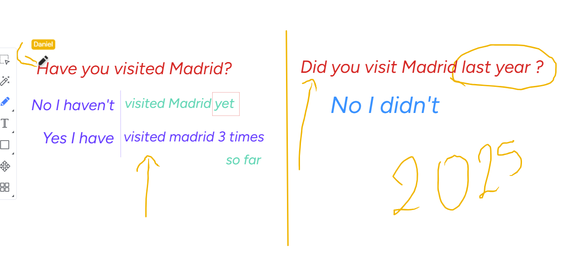
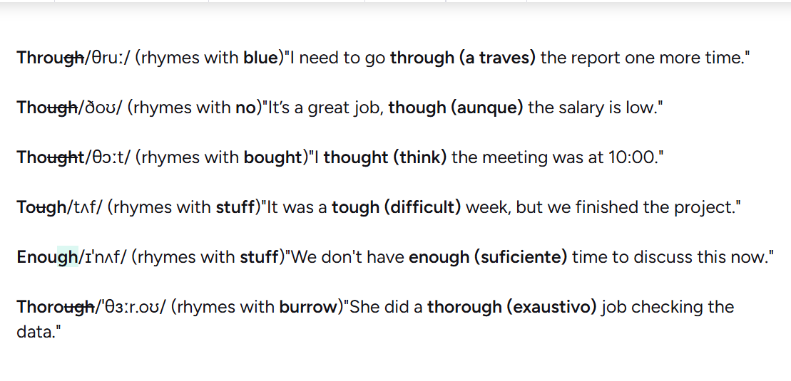

# 📝 Clase 02 — Tenses Overview + Present Perfect

**Fecha:** 2026-02-xx
**Tema:** Tiempos verbales — auxiliares y Present Perfect
**Nivel:** B2

---

## 🗺️ Mapa de tiempos verbales

Un resumen rápido de los **auxiliares** por tiempo:

| Tiempo | Auxiliar | Ejemplo |
|--------|----------|---------|
| **Past Simple** | `did` (negación / preguntas) | *Did you go? / I didn't go.* |
| **Present** | `do / does` | *Do you work here?* |
| **Present Perfect** | `have / has` | *I have visited Paris.* |
| **Future** | `will` | *I will travel next year.* |

---

## ⏱️ Present Perfect

**Auxiliar:** `have` / `has`

Se usa para:
- Experiencias de vida (sin tiempo específico)
- Acciones que conectan el pasado con el presente

> *I **have** eaten sushi.* → en algún momento de mi vida
> vs.
> *I **ate** sushi yesterday.* → momento específico → Past Simple ✅

### Estructura

| Sujeto | Auxiliar | Participio pasado |
|--------|----------|------------------|
| I / You / We / They | **have** | visited / eaten / gone |
| He / She / It | **has** | visited / eaten / gone |

---

## 🔊 Tips de pronunciación

### La "I" vs "Y" — ¡lo opuesto al español!

En español, **i** e **y** suenan igual (i latina).
En inglés es casi al revés:

- **"i"** en inglés suena como la **"ai"** del español → *like*, *night*, *I*
- **"y"** al inicio de palabra suena como la **"ll/y"** del español → *yes*, *you*, *year*

> Ejemplo: **"I"** (yo) se pronuncia **"ai"**, no "i".

---

## 🔗 Recursos

- Imágenes de referencia en esta carpeta (`clase2past.png`, `clase2th.png`)
